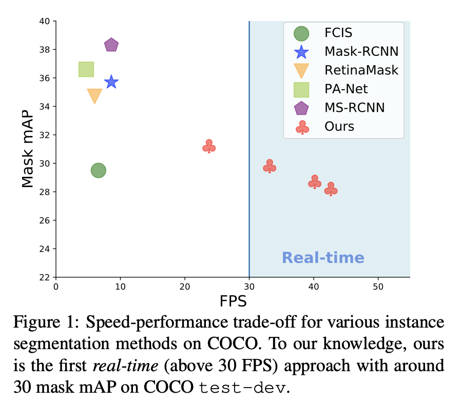
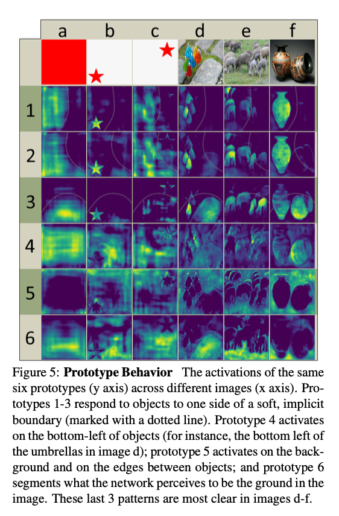
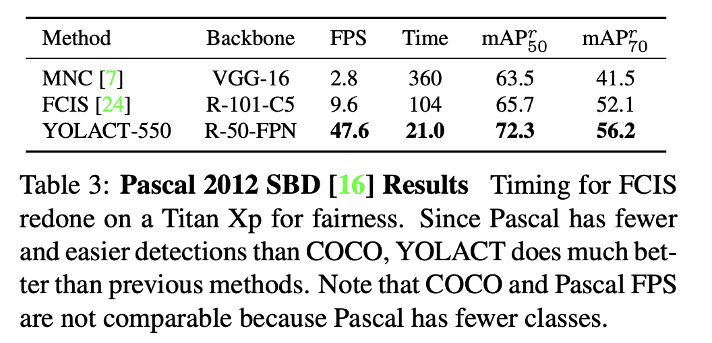
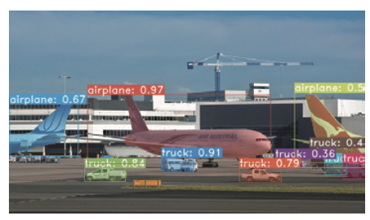
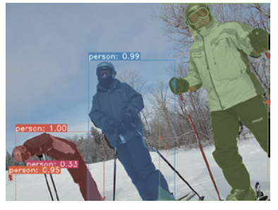

# YOLACT - Most Innovative Award, COCO Object Detection Challenge, ICCV 19

Title: YOLACT: Real-time Instance Segmentation

Review By: Geonsoo Kim

Edited by:

## Reference

- Paper: [https://arxiv.org/abs/1904.02689](https://arxiv.org/abs/1904.02689)
- Code: [https://github.com/dbolya/yolact](https://github.com/dbolya/yolact)
- Blog: [https://ganghee-lee.tistory.com/42?category=863370](https://ganghee-lee.tistory.com/42?category=863370)

## Problem Statement

- State-of-the-art instance segmentation 네트워크들은 accuracy performance 를 집중해서 연구되었고, 이를 위해 localization 과
segmentation 순차적으로 진행되었습니다. 예를들면 Mask R-CNN 은 region proposal 을 통해 class 가 있는 곳을 예측하고나서 mask segmentation 를 
진행하는 구조를 가집니다.
- 이런 구조는 accuracy 측면에서 장점을 가지지만, 크게 두개의 단계를 거쳐야하는 과정 때문에 final output (segmenation mask) 를 얻기까지 상대적으로 
오랜 시간이 걸립니다. COCO Dataset 으로 SOTA 모델 (accuracy 기준) 이였던 Mask R-CNN, MS R-CNN, FCIS, RetinaMask, and PA-Net 은 모두
10 FPS 보다 느린 speed performance 를 보여줍니다. 
- 보통 25~30 FPS 이 넘으면 real-time 이라고 할수있는데 기존의 모델들은 그 기준에 한참 미치지 못합니다.

## Contribution

- YOLACT is the first real-time (above 30 FPS) approach with around 30 mask mAP on COCO test-dev
- A novel Fast NMS approach (12 ms faster than traditional NMS)

## Proposed Method

**(1) Overview**

**(2) Prototype Generation**

- Prototype generation branch (protonet) predicts a set of k prototype masks for the entire image (no explicit localization step)
- Learns how to localize the feature map
- Takes deeper backbone feature as input and produces more robust mask and higher resolution prototypes
- Learns a distributed representation whose instance is segmented with a combination of prototypes that are shared
across categories 

 

**(3) Mask Coefficient & Assembly**

- Typical branches
  - class branch - to predict class confidences
  - bounding box branch - to predict 4 bounding box regressors
  
- Mask coefficient branch
  - third branch to predict k mask coefficients
  - Localize (activate) only one instance among k prototype masks  

- Mask assembly
  - Combine the prototype masks and mask coefficient by using a matrix multiplication

 

  - Apply a sigmoid non-linearity to produce final mask
  - To train the model, three loss functions are used - classification loss, L_cls, box regression loss, L_box, 
and mask loss, L_mask (=BCE(M, M_gt)) with weights 1, 1.5, 6.125

**(4) Fast NMS**

- Non-Maximum suppression (NMS) to suppress duplicated detections
- Typical NMS
  - Sort the detected boxes by confidence
  - Remove the anchor boxes sequentially
- Fast NMS
  - Remove the anchor boxes in parallel
- Reference: [https://https://ganghee-lee.tistory.com/46](https://ganghee-lee.tistory.com/46)

## Experiments

**(1) Datasets**

- MS COCO and Pascal 2012 SBD

**(2) Parameter setting**

- Batch size 8 on a single GPU
- ImageNet pre-trained weight
- SGD optimizer for 800k iterations
- Initial learning rate of 10^-3, weight decay of 5*10^-4, and momentum of 0.9

**(3) Results**

- Comparison of speed and accuracy performance with other models
- YOLACT-500 offers 3.9x faster speed than previous fastest approach
- Also, offers competitive mask mAP
- Speed vs accuracy trade-off in YOLACT models

 
 
 

## Discussion

- Despite being much faster, YOLACT fall behind SOTA instance segmentation methods in overall performance
  - Errors caused by mistakes in the detector
    - misclassification and box misalignment
  - Errors caused by mask generation algorithm
    - Localization failure
      - If there are too many objects in one spot in a scene, the network can fail to localize each object in its own prototype
    - Leakage
      - The model works fine when the bounding box is accurate, but when it is not, the noise outside of the cropped region
      can creep into the instance mask

 
 

## Summary

- Goal: faster (real-time) instance segmentation with competitive accuracy performance
- Contributions
  - parallel subtasks
    - Prototype mask branch - generates prototype masks
    - Mask coefficient branch - predicts mask coefficients for each instances
  - Fast NMS

